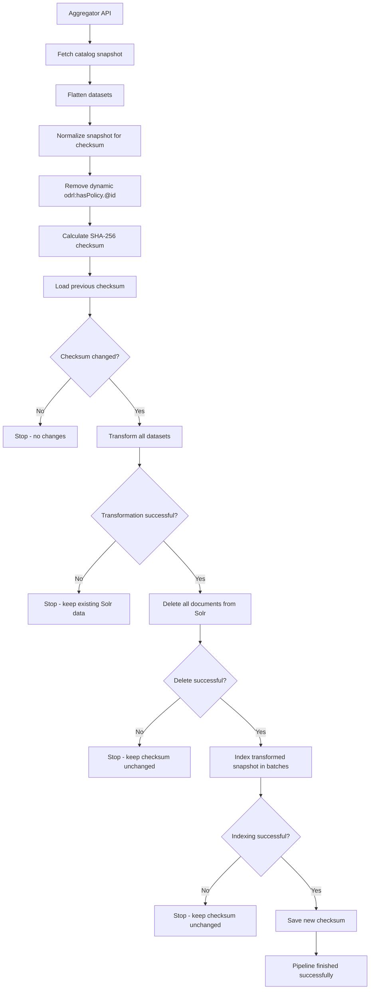

# SAGE Metadata Pipeline

This directory contains the SAGE metadata ingestion and transformation pipeline.

## Prerequisites

- Python 3.10+
- Project dependencies installed
- A valid `sage/.env` configuration file

## Running the pipeline

The pipeline should be executed from the **project root**, not from the `sage` directory.

```bash
python -m sage.pipeline
```

or, if using Pipenv:

```bash
pipenv run python -m sage.pipeline
```

This executes a single pipeline run.

## Running on a schedule

To run the pipeline continuously using the scheduler entrypoint:

```bash
python -m sage.scheduler
```

or, if using Pipenv:

```bash
pipenv run python -m sage.scheduler
```

The scheduler runs the pipeline periodically according to `SCHEDULER_INTERVAL_MINUTES` (10 minutes by default). It uses UTC and continues running if an individual pipeline execution fails. The first pipeline run occurs after the configured interval.

## Configuration

The pipeline reads its configuration from:

```text
sage/.env
```

Ensure the required variables are defined before running the pipeline, for example:

```env
AGGREGATOR_URL=...
AGGREGATOR_API_KEY=...
SOLR_URL=...
SOLR_COLS_NAME=...
REQUEST_TIMEOUT=300
SCHEDULER_INTERVAL_MINUTES=10
```

### Configuration variables

| Variable | Required | Default | Description |
|---|---|---:|---|
| `AGGREGATOR_URL` | Yes | - | SAGE Aggregator catalog query endpoint |
| `AGGREGATOR_API_KEY` | Yes | - | API key used to access the Aggregator |
| `AGGREGATOR_API_LIMIT` | No | `20` | Maximum number of catalog results requested from the Aggregator |
| `SOLR_URL` | Yes | - | Solr server URL |
| `SOLR_COLS_NAME` | Yes | - | Solr collection name |
| `REQUEST_TIMEOUT` | No | `30` | HTTP request timeout in seconds |
| `SCHEDULER_INTERVAL_MINUTES` | No | `10` | Interval between scheduled pipeline runs, in minutes |

## Pipeline workflow

The pipeline synchronizes the SAGE Aggregator dataset snapshot with the Solr collection.



### 1. Fetching data

The pipeline fetches the current catalog snapshot from the SAGE Aggregator API.

The Aggregator may return `dcat:dataset` either as a single object or as a list. Both forms are normalized into a list of datasets.

Catalog-level metadata is also attached to each dataset:

- `catalogue`
- `participant_id`
- `originator`

### 2. Calculating the checksum

After flattening the data, the pipeline calculates a SHA-256 checksum representing the dataset snapshot.

Datasets are sorted by `@id` before calculating the checksum, so the order of datasets in the Aggregator response does not affect the result.

Before calculating the checksum, the dynamically generated:

```text
odrl:hasPolicy.@id
```

value is removed from the checksum input.

The Aggregator may generate a different policy ID for the same dataset between requests. Including this value in the checksum would therefore incorrectly indicate that the dataset had changed.

The rest of the `odrl:hasPolicy` object remains part of the checksum, so actual changes to the policy content can still trigger a synchronization.

The checksum changes when datasets are:

- added
- removed
- modified
- meaningfully changed in their policy content

The previous checksum is stored in:

```text
sage/state/aggregator_checksum
```

### 3. Skipping unchanged snapshots

If the current checksum is equal to the previously stored checksum, no further processing is performed.

The pipeline does not:

- transform datasets
- modify Solr
- re-index documents

This avoids unnecessary processing when the Aggregator data has not changed.

### 4. Transforming the new snapshot

When the checksum changes, the complete dataset snapshot is transformed using:

```python
transform_raw_dataset()
```

Transformation happens **before modifying Solr**.

This ensures that failures during transformation do not cause the existing Solr data to be deleted.

If no datasets can be successfully transformed, the pipeline stops without modifying Solr.

### 5. Replacing the Solr snapshot

After successful transformation, all existing documents are removed from the Solr collection.

The new snapshot is then indexed in batches.

The pipeline uses a full replacement strategy:

```text
DELETE existing documents
        |
        v
INDEX current snapshot
```

This is necessary to correctly handle deleted datasets.

For example, if the previous Aggregator snapshot contains:

```text
dataset A
dataset B
dataset C
```

and the new snapshot contains:

```text
dataset A
dataset B
```

simply updating datasets A and B would leave dataset C in Solr.

Replacing the complete snapshot ensures that Solr represents the current Aggregator state.

### 6. Indexing

The transformed datasets are sent to Solr in batches.

The default batch size is:

```text
200 documents
```

If any batch fails, the indexing operation is considered unsuccessful.

### 7. Saving the checksum

The new checksum is saved **only after successful Solr indexing**.

This is important because the checksum represents the last snapshot that was successfully synchronized with Solr.

For example:

```text
Transform     ✓
Delete Solr   ✓
Index         ✗
Save checksum ✗
```

The previous checksum is therefore retained.

On the next pipeline execution, the changed snapshot will be processed again.

## Failure handling

The pipeline is designed to avoid modifying Solr until the new data has been successfully fetched and transformed.

| Failure | Solr modified? | Checksum updated? |
|---|---:|---:|
| Aggregator fetch fails | No | No |
| No datasets returned | No | No |
| Transformation produces no datasets | No | No |
| Solr delete fails | No* | No |
| Solr indexing fails | Potentially partially | No |
| Complete indexing succeeds | Yes | Yes |

\* The pipeline stops when the delete operation reports a failure.

If indexing fails after the delete operation has succeeded, the Solr collection may temporarily contain an incomplete snapshot. The checksum is not updated in this case, so the next pipeline execution will retry the synchronization.

## Running tests

Tests should be executed from the **project root**.

Run all tests:

```bash
pytest
```

Run only the SAGE pipeline tests:

```bash
pytest sage/tests/
```

Run only the main transform-service tests:

```bash
pytest tests/
```

For more detailed output:

```bash
pytest -v
```

If using Pipenv:

```bash
pipenv run pytest
```

The SAGE tests do not require a running Aggregator or Solr instance. External HTTP requests are mocked where necessary.